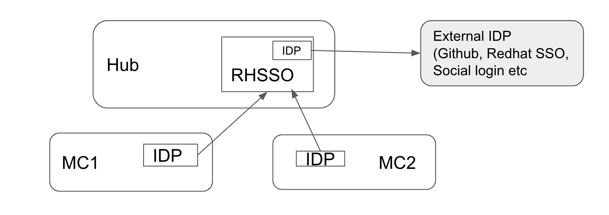

# acm-keycloak-sso

The following describes how to setup RHSSO(KeyCloak) for seamless login across a fleet of clusters managed by ACM.

## The setup involves the following steps

* #### Standup KeyCloak instance on the Hub cluster

    * Install RHSSO Operator
    * Deploy a keycloak instance
    * Configure a separate Realm for ACM clusters
    * Optionally setup a admin user 

* #### Configure KeyCloak to an external IDP ( like Github / auth.redhat.com etc)

    * Through keycloak console, configure browse base authentication through a external IDP.
    * This is optional, Keycloak is an IDP by itself
    * No CRDs available to configure this through k8s, needs to be done through keycloak console

* #### Configure ACM clusters to authenticate through KeyCloak

    * For each cluster in the fleet that needs SSO, Create a Keycloak Client  on the  hub
    * For each cluster in the fleet that needs SSO, Configure keycloak as IDP on the cluster
